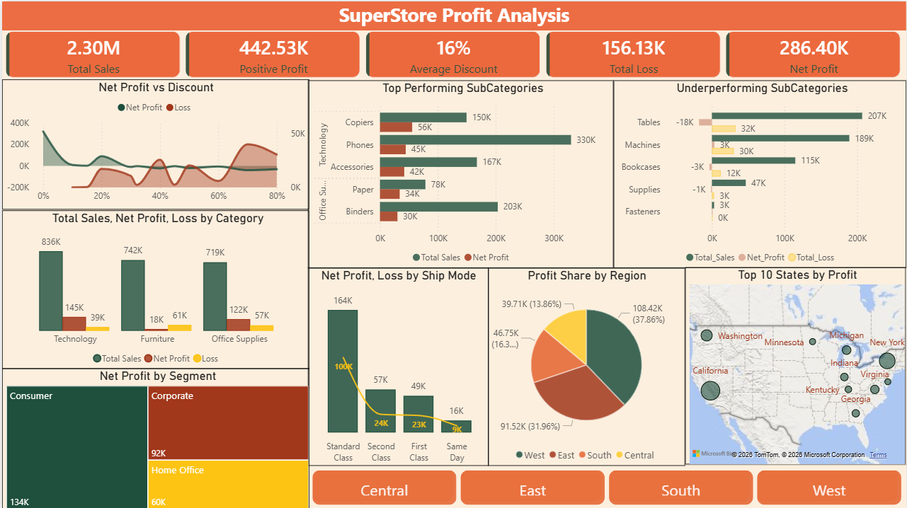

# Superstore Sales & Profit Analysis Dashboard (Power BI)

## 🧾 Project Overview
This project analyzes retail sales data to uncover insights into profitability, discount strategies, product performance, and regional trends. The goal is to identify key drivers of profit and areas causing losses to support data-driven business decisions.

## 🎯 Business Problem
The company is generating strong sales but facing inconsistent and sometimes negative profitability due to ineffective discount strategies, underperforming products, and regional inefficiencies.

## 🎯 Objectives
-	Analyze profit and loss across categories and products 
-	Understand the impact of discount on profitability 
-	Identify high-performing and loss-making products 
-	Evaluate regional and state-level performance 
-	Analyze customer segment contribution to profit 
-	Provide actionable recommendations to improve profitability 

## 📂 Dataset
-	Dataset: Superstore Sales Data 
-	Format: CSV 
-	Size: ~10,000 rows x 21 columns 
- Contains
  - Order details (Order Date, Ship Date, Ship Mode)
  - Customer details (Segment, Region, State)
  - Product details (Category, Sub-Category, Product Name)
  - Metrics (Sales, Quantity, Discount, Profit)
    
## 🧹 Data Cleaning (Power Query)
-	Verified dataset contains no duplicate records or missing values  
-	Converted data types (Date, Numeric, Categorical) for accurate analysis 
-	Converted Discount into percentage format for better readability 
-	Ensured consistency in categorical values 

## 📊 Dashboard Features (Power BI)
- KPI Cards
  - Total Sales
  -	Positive Profit
  -	Total Loss
  -	Net Profit
  -	Average Discount

- Analytical Visuals
  - Profit vs Discount Trend
  -	Top and Underperforming sub-categories
  -	Sales, Profit, and Loss by category
  -	Profit contibution by region
  -	Top States by profit
  -	Profit by customer segment

- Interactive Filters
  - Region slicer 
  -	Dynamic filtering across visuals 

## 💡 Key Insights
- High sales do not guarantee profitability; excessive discounts significantly reduce profit margins.
- Technology and Office Supplies are the most profitable categories, while Furniture underperforms with very low margins.
- Sub-categories like Copiers and Phones drive profit, whereas Tables and Bookcases generate consistent losses.
- West and East regions contribute the majority of total profit, indicating regional imbalance.
- Profit declines sharply when discount exceeds 10%, making discount strategy a key issue.
- Consumer segment is the most profitable, while certain combinations (Furniture + Central region) drive losses.

##  🧠 Business Recommendations 
- Optimize discount strategy by limiting high discount ranges
- Focus on high-margin categories and profitable products
- Re-evaluate pricing and cost structure for loss-making products
- Strengthen operations in high-performing regions
- Improve performance in underperforming regions with targeted strategies

## 🛠 Tools Used
 
-	Power BI (Dashboard & Visualization) 
-	Power Query (Data Cleaning & Transformation) 
-	DAX (Measures & KPIs) 

## 📸 Dashboard Preview
 

